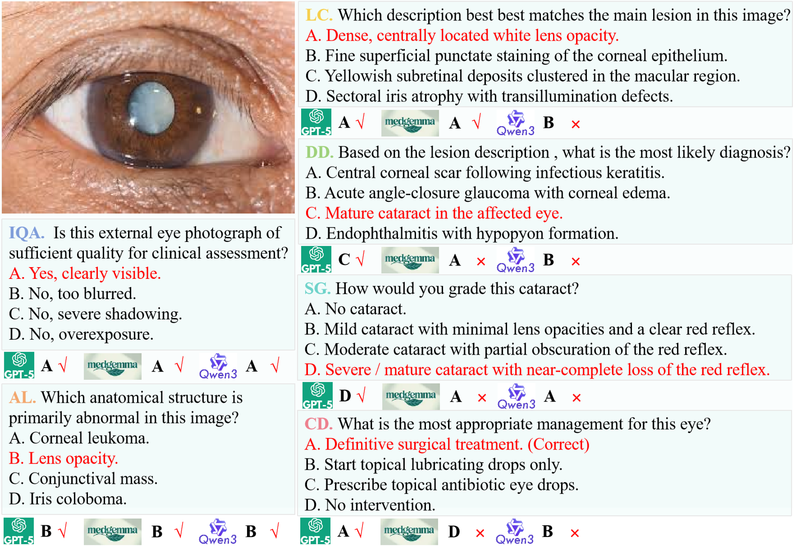
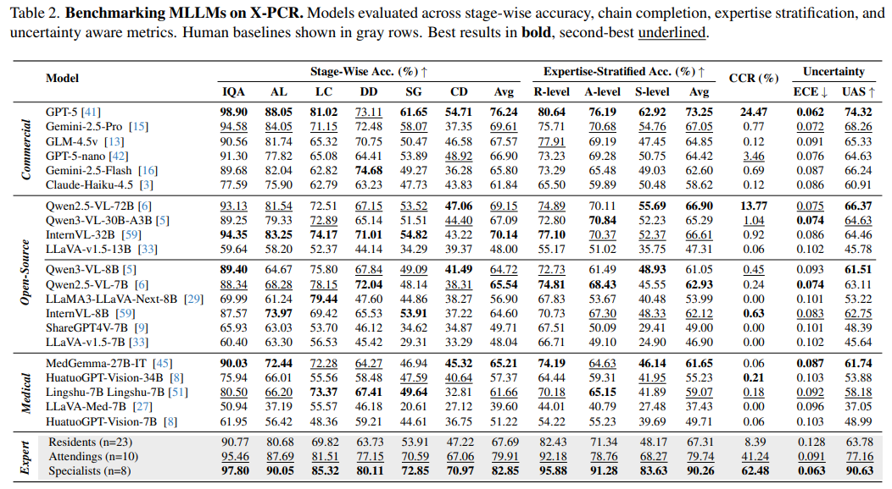

# X-PCR: A Benchmark for Cross-modality Progressive Clinical Reasoning in Ophthalmic Diagnosis

<div align="center">

[](https://huggingface.co/datasets/Fantasy666/X-PCR)
[](https://arxiv.org/abs/2604.20350)

</div>

## 🧑‍⚕️ Overview

**X-PCR** is a benchmark for **Cross-modality Progressive Clinical Reasoning** in ophthalmic diagnosis.  
It is designed to evaluate whether current Multimodal Large Language Models (MLLMs) can perform expert-level ophthalmic reasoning across a complete diagnostic workflow, rather than only answering isolated single-image questions.

Unlike existing medical VQA benchmarks that mainly focus on single-modality or single-step recognition, X-PCR evaluates two clinically important reasoning abilities:

1. **Progressive Clinical Reasoning**: a six-stage diagnostic reasoning chain from image quality assessment to clinical decision-making.
2. **Cross-modality Clinical Reasoning**: integration of complementary evidence from multiple ophthalmic imaging modalities.

X-PCR contains **26,415 ophthalmic images** and **177,868 expert-verified VQA pairs** curated from **51 public datasets**, covering **52 ophthalmic diseases** and **six imaging modalities**.

<p align="center">
  
</p>

## 🔥 News

- **[2026-5-28]** X-PCR dataset is released on Hugging Face.
- **[2026-5-28]** X-PCR paper is released.

## 📌 Highlights

- **Large-scale ophthalmic benchmark**  
  X-PCR includes 26,415 images and 177,868 VQA pairs from 51 datasets.

- **Six-stage progressive reasoning chain**  
  The benchmark follows a clinically inspired diagnostic workflow:
  image quality assessment, anatomical localization, lesion characterization, disease diagnosis, severity grading, and clinical decision-making.

- **Cross-modality clinical reasoning**  
  X-PCR evaluates whether MLLMs can integrate evidence across six ophthalmic modalities:
  EP, CFP, RetCam, OCT, FFA, and ICGA.

- **Expert-verified annotations**  
  The VQA pairs are validated by ophthalmologists to ensure clinical correctness and reasoning consistency.

- **Difficulty- and uncertainty-aware evaluation**  
  X-PCR introduces clinically meaningful evaluation protocols, including stage-wise accuracy, chain completion rate, expertise-stratified accuracy, uncertainty-aware score, and expected calibration error.

## 🧩 Benchmark Design

### 1. Progressive Clinical Reasoning

X-PCR formulates ophthalmic diagnosis as a six-stage reasoning chain:

| Stage | Abbreviation | Description |
|---|---|---|
| Stage 1 | IQA | Image Quality Assessment |
| Stage 2 | AL | Anatomical Localization |
| Stage 3 | LC | Lesion Characterization |
| Stage 4 | DD | Disease Diagnosis |
| Stage 5 | SG | Severity Grading |
| Stage 6 | CD | Clinical Decision-Making |

The six stages are logically dependent.  
For example, a model should first determine whether the image quality is sufficient, then localize anatomical structures, characterize lesions, diagnose disease, grade severity, and finally make clinical decisions.

<p align="center">
  
</p>

### 2. Cross-modality Clinical Reasoning

Ophthalmic diagnosis often requires synthesizing complementary evidence from multiple imaging modalities.  
X-PCR covers six commonly used ophthalmic modalities:

| Modality | Full Name |
|---|---|
| EP | External Photography |
| CFP | Color Fundus Photography |
| RetCam | RetCam Imaging |
| OCT | Optical Coherence Tomography |
| FFA | Fluorescein Angiography |
| ICGA | Indocyanine Green Angiography |

The cross-modality reasoning task evaluates three key abilities:

- **Correspondence Identification**: identifying semantically corresponding findings across modalities.
- **Diagnostic Integration**: integrating multi-modal evidence for disease diagnosis.
- **Modality Selection**: selecting the most informative next imaging modality under diagnostic uncertainty.

<p align="center">
  
</p>

## 📊 Dataset Statistics

X-PCR contains:

| Item | Number |
|---|---:|
| Images | 26,415 |
| VQA pairs | 177,868 |
| Public datasets | 51 |
| Imaging modalities | 6 |
| Disease categories | 8 |
| Ophthalmic diseases | 52 |
| Hospital-collected multi-modal cases | 58 |

The dataset covers eight major disease categories:

- Diabetic Retinopathy
- Glaucoma
- Cataract
- Age-related Macular Degeneration
- Hypertensive Retinopathy
- Pathological Myopia
- Retinal Vein Occlusion
- Rare Ophthalmic Diseases

<p align="center">
  
</p>

## 📦 Dataset Download

The X-PCR dataset is available at Hugging Face:

```text
https://huggingface.co/datasets/Fantasy666/X-PCR
```

You can download the dataset using:

```bash
git lfs install
git clone https://huggingface.co/datasets/Fantasy666/X-PCR
```

or with the Hugging Face `datasets` library:

```python
from datasets import load_dataset

dataset = load_dataset("Fantasy666/X-PCR")
```

## 📁 Recommended Data Structure

After downloading the dataset, we recommend organizing the files as follows:

```text
X-PCR/
├── images/
│   ├── CFP/
│   ├── OCT/
│   ├── FFA/
│   ├── ICGA/
│   ├── EP/
│   └── RetCam/
├── annotations/
│   ├── train.json
│   ├── val.json
│   └── test.json
├── multimodal_cases/
│   ├── case_001/
│   ├── case_002/
│   └── ...
└── README.md
```

## 🧪 Evaluation

X-PCR evaluates MLLMs from multiple perspectives.

### Stage-Wise Accuracy

Stage-Wise Accuracy measures model performance at each reasoning stage:

```text
IQA → AL → LC → DD → SG → CD
```

This metric reveals how model accuracy changes along the progressive diagnostic chain.

### Chain Completion Rate

Chain Completion Rate evaluates whether a model can correctly complete the entire six-stage reasoning chain.

A chain is considered correct only when all six stages are answered correctly.

### Expertise-Stratified Accuracy

Questions are stratified into three clinical difficulty levels:

| Level | Description |
|---|---|
| Resident | Basic recognition and localization |
| Attending | Contextual diagnosis and disease interpretation |
| Specialist | Subspecialty-level reasoning and decision-making |

### Uncertainty-Aware Evaluation

X-PCR further evaluates whether models are well-calibrated by using:

- **Uncertainty-Aware Score**
- **Expected Calibration Error**

These metrics are important for clinical deployment, where overconfident incorrect predictions may lead to unsafe decisions.

## 🚀 Quick Start

### Installation

```bash
git clone https://github.com/CVI-SZU/X-PCR.git
cd X-PCR

conda create -n xpcr python=3.10
conda activate xpcr

pip install -r requirements.txt
```

### Run Evaluation

```bash
python evaluate.py \
    --data_path ./data/test.json \
    --image_root ./data/images \
    --model_name your_model_name \
    --output_path ./outputs/predictions.json
```

### Compute Metrics

```bash
python compute_metrics.py \
    --prediction_path ./outputs/predictions.json \
    --annotation_path ./data/test.json
```

## 📈 Benchmark Results

We evaluate 21 representative MLLMs, including commercial models, open-source models, and medical-specialized models.

<p align="center">
  
</p>

### Main Findings

- Commercial MLLMs achieve the best overall performance but still struggle with complete clinical reasoning chains.
- Model accuracy generally decreases from early-stage perception tasks to high-level clinical decision-making.
- Current MLLMs remain far below ophthalmology specialists in chain completion and specialist-level reasoning.
- Cross-modality reasoning remains challenging, especially when models need to integrate OCT, FFA, ICGA, and CFP evidence.
- Medical-specialized MLLMs do not always outperform strong general-purpose MLLMs, suggesting that domain knowledge alone is insufficient for progressive clinical reasoning.

## 🏥 Human Expert Baseline

X-PCR includes human expert evaluation from three clinical expertise levels:

- Residents
- Attendings
- Specialists

The results show that current MLLMs still have a substantial gap compared with ophthalmology specialists, especially in end-to-end reasoning consistency and clinical decision-making.

## 📚 Citation

If you find X-PCR useful for your research, please consider citing our paper:

```bibtex
@inproceedings{wang2026xpcr,
  title={X-PCR: A Benchmark for Cross-modality Progressive Clinical Reasoning in Ophthalmic Diagnosis},
  author={Wang, Gui and Zhong, Zehao and Zhou, YongSong and Li, Yudong and Wu, Ende and Cheah, Wooi Ping and Qu, Rong and Ren, Jianfeng and Shen, Linlin},
  booktitle={Proceedings of the IEEE/CVF Conference on Computer Vision and Pattern Recognition},
  year={2026}
}
```

## 🙏 Acknowledgements

This work was supported by the National Natural Science Foundation of China, Ningbo Municipal Bureau of Science and Technology, Guangdong Provincial Key Laboratory, and the Intelligent Computing Center of Shenzhen University.

We thank all ophthalmologists and clinical experts who contributed to the annotation, validation, and evaluation of X-PCR.


## 📄 License

The dataset is released for academic research purposes only.  
Please refer to the dataset license and usage agreement before using X-PCR.
